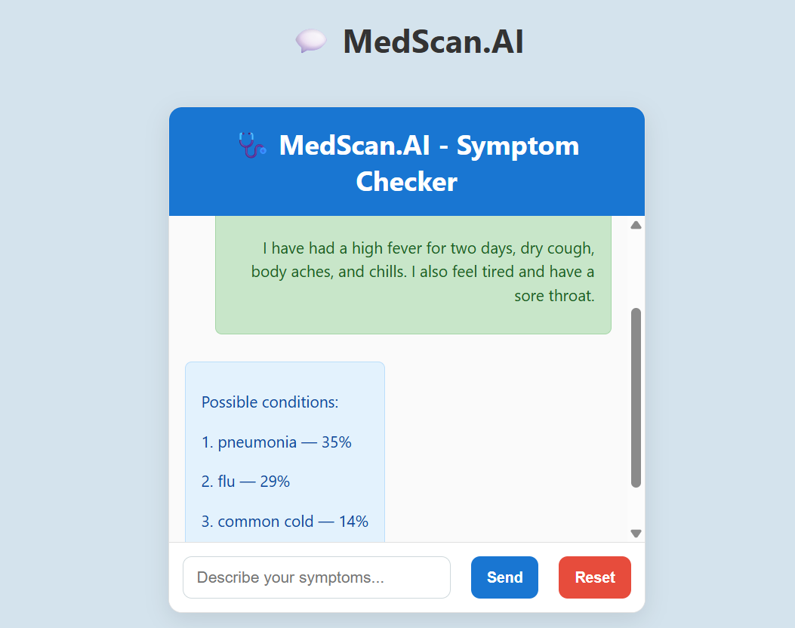

# 🩺 MedScan.AI — Symptom-Based Disease Prediction Chatbot

MedScan.AI is a full-stack AI-powered web application that predicts possible diseases from natural language descriptions of symptoms. It features an intuitive chat interface where users can describe their symptoms, and receive a ranked list of potential conditions using a powerful ensemble of machine learning models.

---

## 🌐 Live Demo

You can check out the live deployed version of **MedScan.AI** here:

🔗 **[Visit MedScan.AI](https://medscan-ai.vercel.app/)**

> 

---

## ⚙️ Tech Stack

### 📦 Backend
- **FastAPI** – Lightweight Python API framework
- **Scikit-learn** – Model training and inference
- **Joblib** – Model serialization
- **Uvicorn** – ASGI server

### 💻 Frontend
- **React.js** – UI framework
- **CSS (custom)** – Chat UI styling
- **Fetch API** – Communication with backend

### 🧠 ML Libraries
- `scikit-learn` for training:
  - `TfidfVectorizer`
  - `LogisticRegression`
  - `CalibratedClassifierCV (SVM)`
  - `RandomForestClassifier`
  - `VotingClassifier`

---

## 🧠 Machine Learning Model Logic

1. **Symptom Vectorization**
   - User input is cleaned and vectorized using **TF-IDF**.
   - Text data becomes a numerical feature vector.

2. **Individual Models**
   - Trained on a labeled symptom-disease dataset.
   - Models: Logistic Regression, Random Forest, and Calibrated SVM.

3. **Soft Voting Ensemble**
   - Each model outputs probability scores for all diseases.
   - A **weighted average** is taken based on model accuracy:
     ```python
     avg_proba = log_proba * w1 + svm_proba * w2 + rf_proba * w3
     ```

4. **Top-k Prediction**
   - The top 3 diseases with the highest averaged probabilities are returned.
   - If the highest probability is below a threshold (e.g., 40%), a disclaimer is shown.

---

## 🚀 Features

✅ Predicts **top 3 possible diseases** with probabilities  
✅ Accumulates multiple symptom messages across a session  
✅ "Reset" and "End" functionality to manage sessions  
✅ Confidence-based **disclaimer** for low-certainty predictions  
✅ Scrollable, responsive chat interface built in React  
✅ Persistent local storage for chatbot history  
✅ REST API with Swagger documentation (`/docs`)

---


## 🛠️ Installation & Setup

### 🔽 Model Files & Dataset

Model and vectorizer files are hosted on Google Drive. They are auto-downloaded on first run using `gdown`.

If you prefer manual download, grab them from this folder:  
👉 [Google Drive Folder](https://drive.google.com/drive/folders/1CrhC1hfwhTJfvsBjuaRE479pPysU1CMO)

Place all `.pkl` files inside the `/models` folder.

```bash
git clone https://github.com/puravnayak/medscan-ai.git
cd medscan-ai
```

### Backend Setup (FastAPI)
```bash
pip install -r backend/requirements.txt

cd backend
uvicorn app.main:app --reload
```

### Frontend Setup (React)
Note: Change the BASE_URL in ChatBot.js to run locally

```bash
cd frontend
npm install
npm start
```
---

## Credits
Dataset: https://www.kaggle.com/datasets/dhivyeshrk/diseases-and-symptoms-dataset/data
